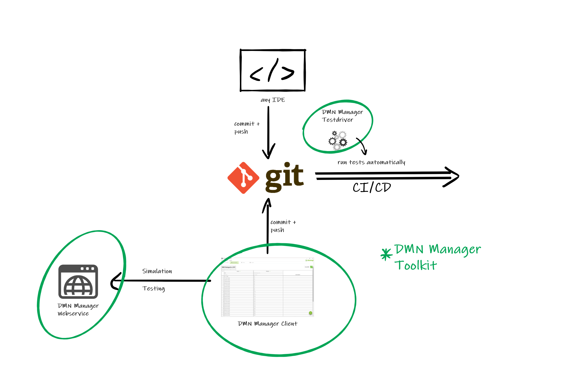

# dmnmgr-server

The DMN Manager is a toolkit incoperating the Camunda DMN implementation and providing
tools to develop DMN based applications in cross functional teams.

## General architecture

- The client application is used to visually define business rules, simulate decision models and write tests. (https://github.com/davidibl/dmnmgr-client)
- The server-side application provides web services to simulate decisions, run tests and validate DMN definitions. (This repository)
- The test driver is a java library to run tests defined in the DMN Manager client during CI/CD processes automatically. (This repository)

## Use

The DMN Manager server-side component is a java spring boot based webservice. To run this service, just build the project and run the jar file inside the target folder of the child project 'dmnmgr'.

To use the test driver, provision any artifactory or any java project with the jar library from the target folder of the 'dmnmgr-test-driver' child project.

## Automatic dmn test execution

To enable automatic test execution during build process of any java project, import a dmn file in the DMN Manager client tool, define tests and save the project into the resources folder of the java project.

After saving a DMN Manager project a new file with the extension *.dmnapp.json will appear next to the original dmn file. This file contains all the testcases and test expectations.

Now, just create a Java class with the following annotation:

`
@RunWith(DmnTester.class)
`

All testcases defined in the dmnapp.json file will now be executed during normal test phase of the build process.

## Customization

The web service to validate, simulate and test decisions uses a specific version of the Camunda feel-scala engine to fulfill all requests. To ensure production near behaviour during development time it is recommended to build the webservice with a decision engine as near as possible to the production scenario.
